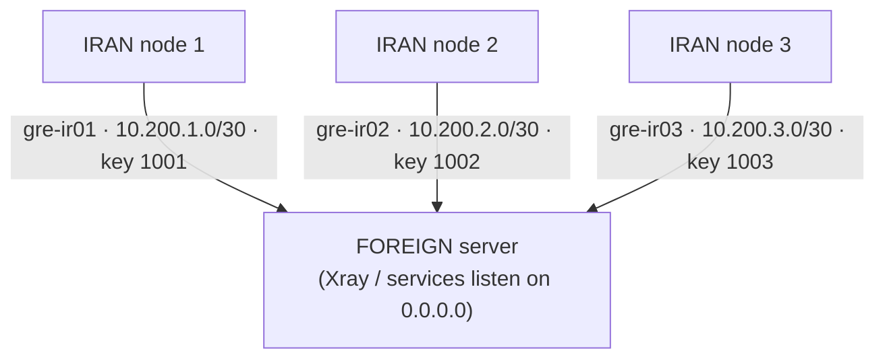

# Multi-GRE Tunnel Manager

<p>
  <a href="https://github.com/aibedini/gre-manager/actions/workflows/ci.yml"></a>
  <a href="https://github.com/aibedini/gre-manager/releases"></a>
  <a href="LICENSE"></a>
  
  
</p>

Menu-driven manager for **multiple GRE tunnels**: connect **many IRAN servers** to **one FOREIGN server**,
with per-node isolation, selective port forwarding, an auto-healing watchdog, and systemd persistence —
all through a single `gre` command. Interactive menu for humans, non-interactive CLI for automation.



## Contents

- [Features](#features)
- [Install](#install)
- [Quick start](#quick-start)
- [Menu guide](#menu-guide)
- [CLI reference](#cli-reference)
- [Automation example](#automation-example)
- [Files & paths](#files--paths)
- [How it works](#how-it-works)
- [Watchdog & downtime tolerance](#watchdog--downtime-tolerance)
- [Notes & security](#notes--security)
- [Uninstall & purge](#uninstall--purge)
- [Upgrading](#upgrading)
- [Versioning](#versioning)
- [راهنمای فارسی](#راهنمای-فارسی)

---

## Features

**Core**
- **One command** — after install, just run `sudo gre` and the menu loads.
- **Multi-node** — each Iran server gets its own tunnel name, `/30` subnet and GRE key; up to 254 nodes on one foreign server.
- **Selective port forwarding** — forward only the TCP/UDP ports you choose from each Iran public IP to the foreign server (multiport + ranges, SSH port 22 protected by an explicit confirmation).
- **systemd persistence** — tunnels and NAT rules are re-applied automatically after reboot (`multi-gre.service`).

**Reliability**
- **Auto-heal watchdog** — a systemd timer re-checks every tunnel and revives dead ones automatically (`journalctl -t gre-watchdog`).
- **Your downtime tolerance** — at setup you say how many minutes of downtime are acceptable; the watchdog interval is derived from it. Change or cancel anytime.
- **MSS clamping** — optional TCPMSS clamp on the tunnel to avoid broken-PMTU stalls (half-loading websites).
- **Idempotent & safe** — re-running any action never duplicates iptables rules; deletions check existence first.

**Security**
- **GRE whitelist (firewall hardening)** — on the foreign server, only known Iran node IPs may speak GRE (proto 47); everything else is dropped.
- **Checksum-verified installs** — installer and `gre update` verify the release SHA-256 before touching your system.
- **Config permissions** — all files under `/etc/multi-gre/` are mode `0600`.
- **Audit log** — every change is appended to `/var/log/gre-manager.log`.

**Operations & automation**
- **Non-interactive CLI** — every setup step can be scripted (`gre node add`, `gre iran-setup`, …) for Ansible & co.
- **JSON status** — `gre status --json` for monitoring systems (pure bash, no `jq` needed).
- **Doctor** — `gre doctor` runs health checks (tunnels, NAT rules, firewall, systemd, port conflicts) and exits non-zero on failure.
- **Backup & restore** — `gre export` / `gre import` move the whole configuration between servers as a single tar.gz.
- **Three cleanup levels** — uninstall (this version), legacy cleanup (vatanhost script), and `gre purge` (scorched earth: every GRE artifact from any version or tool).
- **Self-update** — `gre update` pulls the latest pinned release from GitHub.

## Install

On **every** server (foreign and all Iran nodes):

```bash
curl -fsSL https://raw.githubusercontent.com/aibedini/gre-manager/main/install.sh | sudo bash
```

The installer downloads the latest **pinned release**, verifies its **SHA-256 checksum**,
installs the `gre` command to `/usr/local/sbin/gre` plus bash completion, and shows progress:

```
  Multi-GRE Tunnel Manager — installer
  github.com/aibedini/gre-manager

  Checking dependencies        [################################] 25%
  Downloading gre-manager      [################################] 55%
  Verifying SHA-256 checksum   [################################] 75%
  Installing gre command       [################################] 100%

  [+] gre-manager v1.5.0 installed -> /usr/local/sbin/gre
```

For the bleeding-edge main branch instead (no checksum):

```bash
curl -fsSL https://raw.githubusercontent.com/aibedini/gre-manager/main/install.sh | sudo GRE_EDGE=1 bash
```

Then run:

```bash
sudo gre
```

```
   __________  ____     __  ___
  / ____/ __ \/ __ \   /  |/  /__ _____  ____ _____ ____  _____
 / / __/ /_/ / /_/ /  / /|_/ / _ `/ _ \/ _ `/ _ `/ -_) __/
 \____/_/ |_/_____/  /_/  /_/\_,_/_//_/\_,_/\_, /\__/_/
                                           /____/
  Multi-GRE Tunnel Manager  v1.5.0  ·  github.com/aibedini/gre-manager
  ═════════════════════════════════════════════════════════════
  Role: FOREIGN   Tunnels: ● 3 up   Watchdog: ● ON · every 1m
  ── Tunnels ─────────────────────────────────────────────────
  1) Configure this server as an IRAN node
  2) Configure this server as FOREIGN / add an Iran node
  3) Remove an Iran node from FOREIGN                  [3 nodes]
  4) Restart all configured tunnels
  5) Stop all configured tunnels
  ── Monitoring ──────────────────────────────────────────────
  6) Status & health
  7) Auto-heal watchdog                                ● ON · every 1m
  8) Doctor (diagnostics)
  ── Maintenance ─────────────────────────────────────────────
  9) Backup / restore (export / import)
 10) Clean up original vatanhost gre.sh (vatan-m2)
 11) Update gre-manager to the latest version
 12) Uninstall from this server
 13) PURGE: remove EVERYTHING GRE (danger)
  0) Exit
  ═════════════════════════════════════════════════════════════
```

## Quick start

1. **FOREIGN server** — run `sudo gre`, choose **2**. On first run it registers the foreign IP,
   asks about firewall hardening and your downtime tolerance, then adds one Iran node per run.
   After each node it prints the exact values to enter on the Iran side.
2. **Each IRAN server** — run `sudo gre`, choose **1**, enter the values from step 1
   (node name, tunnel index, GRE key must match) plus the ports you want to forward.
3. **Verify** — from Iran `ping 10.200.<idx>.1`, from foreign `ping 10.200.<idx>.2`,
   or use menu option **6** (live ping per node) / **8** (doctor).

Addressing plan (automatic — index, subnet and key are suggested for you):

| Node   | Tunnel     | Foreign side    | Iran side       | GRE key |
| ------ | ---------- | --------------- | --------------- | ------- |
| `ir01` | `gre-ir01` | `10.200.1.1/30` | `10.200.1.2/30` | `1001`  |
| `ir02` | `gre-ir02` | `10.200.2.1/30` | `10.200.2.2/30` | `1002`  |
| `ir03` | `gre-ir03` | `10.200.3.1/30` | `10.200.3.2/30` | `1003`  |

## Menu guide

| Option | What it does |
| ------ | ------------ |
| **1** | Configure this server as an IRAN node (interactive; asks IPs, node name, index, key, ports, MSS clamp, downtime tolerance) |
| **2** | Configure this server as FOREIGN (first run) / add another Iran node (subsequent runs) |
| **3** | Remove one Iran node from FOREIGN (tunnel + firewall rule + config) |
| **4** | Restart all configured tunnels (stop + apply, idempotent) |
| **5** | Stop all tunnels but keep config (they return after reboot or menu 4) |
| **6** | Status: roles, tunnels, addresses, NAT rules, live ping per node, systemd states |
| **7** | Watchdog submenu: live state, change downtime tolerance, enable, disable |
| **8** | Doctor: PASS/WARN/FAIL diagnostics with non-zero exit on failure |
| **9** | Backup/restore submenu: export config to tar.gz, import it back |
| **10** | Remove everything the original `vatanhost/gre` script created |
| **11** | Self-update to the latest release (checksum-verified) |
| **12** | Uninstall gre-manager from this server (keeps nothing) |
| **13** | **PURGE** — remove EVERYTHING GRE-related (see [below](#uninstall--purge)) |
| **0** | Exit (Ctrl+C anywhere returns to the menu instead of killing the program) |

## CLI reference

| Command | Description |
| ------- | ----------- |
| `gre` | Interactive menu |
| `gre status [--json]` | Status; `--json` for machine-readable output (no `jq` needed) |
| `gre doctor` | Diagnostics: PASS/WARN/FAIL per check, non-zero exit on FAIL |
| `gre node list [--json]` | List configured Iran nodes (FOREIGN) |
| `gre node add` | Add an Iran node (FOREIGN): `--name NAME --ip IRAN_IP [--idx N] [--key K] [--yes]` |
| `gre node remove` | Remove an Iran node (FOREIGN): `--name NAME [--yes]` |
| `gre iran-setup` | Non-interactive Iran setup: `--foreign-ip IP [--iran-ip IP] [--name NAME] [--idx N] [--key K] [--wan IFACE] [--tcp-ports LIST] [--udp-ports LIST] [--mss-clamp on\|off] [--downtime MIN] [--yes]` |
| `gre export [path] [--yes]` | Back up `/etc/multi-gre` to a tar.gz (mode 600) |
| `gre import <file> [--yes]` | Restore a backup created by `gre export` (rejects unsafe archives) |
| `gre watchdog` | Watchdog: `enable` / `disable` / `status` / `interval <1-60>` |
| `gre update` | Self-update to the latest release (SHA-256 verified) |
| `gre purge [--yes]` | Remove EVERYTHING GRE-related from the server |
| `gre --apply` | Bring up all configured tunnels (used by systemd) |
| `gre --stop` | Tear down all tunnels, keep config (used by systemd) |
| `gre --watchdog` | One watchdog pass (used by the systemd timer) |
| `gre --version` / `gre --help` | Version / usage |

All mutating commands ask for confirmation unless `--yes` is passed.

### Automation example

```bash
# FOREIGN server (run 'sudo gre' -> option 2 once first for the initial setup):
gre node add --name ir01 --ip 5.6.7.8 --yes          # idx/key default to 1/1001
gre node add --name ir02 --ip 5.6.7.9 --yes
gre node list --json

# IRAN server:
gre iran-setup --foreign-ip 1.2.3.4 --name ir01 --idx 1 --key 1001 \
    --tcp-ports 80,443,8443 --udp-ports 443 --downtime 2 --yes

# Monitoring / config management:
gre status --json
gre doctor                                           # exit code != 0 if anything FAILs
gre export /root/gre-backup.tar.gz --yes
gre watchdog interval 2                              # check every 2 minutes
```

## Files & paths

| Path | Purpose |
| ---- | ------- |
| `/usr/local/sbin/gre` | The `gre` command |
| `/etc/multi-gre/foreign.conf` | Foreign role: IP, ICMP drop, GRE whitelist flags |
| `/etc/multi-gre/iran.conf` | Iran role: peer IPs, index, key, ports, MSS flag |
| `/etc/multi-gre/global.conf` | Watchdog: enabled, interval, downtime tolerance |
| `/etc/multi-gre/nodes/<name>.conf` | One file per Iran node (foreign side) |
| `/etc/systemd/system/multi-gre.service` | Re-applies everything at boot (`gre --apply`) |
| `/etc/systemd/system/multi-gre-watchdog.{service,timer}` | Auto-heal watchdog |
| `/etc/sysctl.d/99-multi-gre.conf` | `net.ipv4.ip_forward=1` (Iran side) |
| `/var/log/gre-manager.log` | Audit log (who changed what, when) |
| `/etc/bash_completion.d/gre` | bash completion |

## How it works

- **IRAN node**: packets arriving on the public IP at the configured ports are DNAT-ed into the tunnel
  towards `10.200.<idx>.1` (the foreign end) and SNAT-ed to `10.200.<idx>.2`, so replies flow back
  through conntrack automatically. `net.ipv4.ip_forward` is enabled and persisted.
- **FOREIGN node**: one GRE tunnel per Iran node. Services listening on `0.0.0.0`
  (e.g. Xray) are reachable through every tunnel at once.
- **Boot persistence**: the systemd unit runs `gre --apply`, which recreates tunnels and re-adds
  only the missing iptables rules (never duplicates).
- **GRE whitelist ordering**: per-node ACCEPT rules are always re-inserted before the proto-47
  block rule, so adding a node never breaks existing ones.

## Watchdog & downtime tolerance

At setup you are asked:

```
[*] Auto-heal watchdog
[*] If a tunnel dies, the watchdog revives it automatically.
[*] How many minutes of tunnel downtime are acceptable for you? (0 = disable auto-heal)
Downtime tolerance in minutes [2]:
```

- The watchdog checks every `tolerance / 2` minutes (minimum 1), so real downtime stays under your number.
- `0` disables auto-heal entirely.
- Change or cancel **anytime**: menu option **7**, or `gre watchdog interval N` / `gre watchdog disable` / `gre watchdog enable`.
- Watchdog actions are logged to the journal: `journalctl -t gre-watchdog`.
- For automation: `gre iran-setup ... --downtime MIN`.

## Notes & security

- GRE is **not encrypted** — it is a transport/tunnel, not a VPN. Run your real service (e.g. Xray/TLS) on top.
- The GRE `key` only separates tunnels; it is not authentication.
- Only the ports you list are forwarded — SSH access to each Iran server stays local unless you explicitly forward port 22.
- If the foreign server's IP gets blocked, all nodes lose connectivity: the foreign host is a single point of failure.
- Works on systemd-based Debian/Ubuntu (and most RHEL-likes); requires `iproute2`, `iptables`, `curl`.
- Modern distros with `iptables-nft` are supported — rules land in nftables automatically.

## Uninstall & purge

Three cleanup levels, depending on how deep you want to go:

| Level | Command | Removes |
| ----- | ------- | ------- |
| **Uninstall** | menu **12** | Everything this gre-manager version configured (tunnels, rules, units, config, the `gre` command) |
| **Legacy cleanup** | menu **10** | Only what the original `vatanhost/gre` script created (`vatan-m2`, its broad rules) |
| **PURGE** | `gre purge` / menu **13** | **Everything GRE-related** from any version or tool |

```bash
sudo gre   # -> option 12 (Uninstall) or 13 (PURGE)

sudo gre purge        # asks for confirmation
sudo gre purge --yes  # non-interactive
```

PURGE deletes every GRE/GRETAP tunnel (even hand-made ones), every iptables rule in
`filter`/`nat`/`mangle` mentioning GRE artifacts (`multi-gre`, GRE interfaces, proto 47,
`10.200.0.0/16`, `132.168.30.0/30`), the legacy vatanhost broad rules, all systemd units,
`/etc/multi-gre`, the sysctl file, the audit log, bash completion, and the
`gre` / `multi-gre-manager` commands themselves. If other software on the server uses GRE,
it will be affected — the warning lists everything before you confirm.

## Upgrading

```bash
sudo gre update
```

Prefers the latest **pinned release**, verifies its SHA-256 checksum, refuses to install on
mismatch, and only falls back to the main branch (with a warning) when release assets are
unavailable. Your configuration, watchdog settings and nodes are preserved across updates.

## Versioning

This project uses [Semantic Versioning](https://semver.org/). Every `v*` tag automatically
builds the `gre` + `gre.sha256` release assets via GitHub Actions; CI runs ShellCheck,
syntax checks, smoke tests and a version-consistency check on every push.
See [CHANGELOG.md](CHANGELOG.md) and the [releases page](https://github.com/aibedini/gre-manager/releases).

## License

[MIT](LICENSE)

---

## راهنمای فارسی

این ابزار چند سرور **ایران** را از طریق تونل GRE به **یک سرور خارج** وصل می‌کند؛ هر سرور ایران تونل، ساب‌نت و کلید GRE اختصاصی خودش را دارد (تا ۲۵۴ نود روی یک سرور خارج).

### نصب (روی همهٔ سرورها)

```bash
curl -fsSL https://raw.githubusercontent.com/aibedini/gre-manager/main/install.sh | sudo bash
sudo gre
```

نصب‌کننده آخرین ریلیز رسمی را با تأیید checksum (SHA-256) نصب می‌کند.

### ترتیب راه‌اندازی

1. روی سرور **خارج**: `sudo gre` → گزینهٔ `2` — بار اول IP خارج، سؤال امنیتی فایروال و «تحمل قطعی» را می‌پرسد؛ بعد برای هر سرور ایران یک بار اجرا کنید. آخر کار مقادیری می‌دهد (نام نود، index، key).
2. روی هر سرور **ایران**: گزینهٔ `1` — همان مقادیر را وارد کنید و پورت‌هایی که باید به خارج منتقل شوند را بدهید (مثلاً `80,443,8443`).
3. تست: گزینهٔ `6` (پینگ زندهٔ هر نود) یا گزینهٔ `8` (doctor) یا `ping 10.200.<idx>.1` از سمت ایران.

### سؤال «تحمل قطعی» چیست؟

موقع نصب می‌پرسد چند دقیقه قطعی تونل برایتان قابل قبول است. واچداگ (بازسازی خودکار تونل مرده) بر اساس همان تنظیم می‌شود:

- مثلاً `4` دقیقه → واچداگ هر ۲ دقیقه چک می‌کند تا قطعی واقعی زیر ~۴ دقیقه بماند
- `0` → auto-heal کاملاً خاموش
- تغییر یا لغو در هر زمان: گزینهٔ `7` در منو، یا `gre watchdog interval N` و `gre watchdog disable`

### قابلیت‌های مهم

- **بازگشت خودکار بعد از reboot** — سرویس `multi-gre.service` همه‌چیز را دوباره بالا می‌آورد
- **واچداگ auto-heal** — تونل مرده را خودکار بازسازی می‌کند (`journalctl -t gre-watchdog`)
- **فایروال سمت خارج** — فقط IP نودهای شناخته‌شده می‌توانند GRE بزنند
- **MSS clamp** — رفع مشکل نصفه باز شدن سایت‌ها
- **پورت ۲۲ (SSH)** — پیش‌فرض منتقل نمی‌شود؛ اگر واردش کنید هشدار جدی می‌گیرید
- **اتوماسیون** — همهٔ کارها بدون منو: `gre node add --name ir01 --ip x.x.x.x --yes` و `gre iran-setup ...`
- **بکاپ** — `gre export` / `gre import` برای جابه‌جایی کل تنظیمات بین سرورها
- **به‌روزرسانی** — `sudo gre update` (با تأیید checksum)

### حذف و پاک‌سازی (سه سطح)

| سطح | دستور | چه چیزی پاک می‌شود |
| --- | --- | --- |
| حذف معمولی | گزینهٔ `12` | هرچه همین ورژن ساخته |
| پاک‌سازی vatanhost | گزینهٔ `10` | فقط آثار اسکریپت قدیمی vatanhost |
| **پاک‌سازی کامل** | `sudo gre purge` یا گزینهٔ `13` | **هر چه به GRE ربط دارد** — تونل‌ها (حتی دستی و ورژن‌های قدیمی)، همهٔ ruleهای مرتبط، یونیت‌ها، کانفیگ و خود دستور `gre` |

### نکات امنیتی

- GRE رمزنگاری **ندارد**؛ سرویس اصلی (مثل Xray) باید روی آن امن باشد.
- کلید GRE فقط برای تفکیک تونل‌هاست، رمز نیست.
- اگر IP سرور خارج فیلتر شود همهٔ نودها قطع می‌شوند — سرور خارج نقطهٔ شکست مشترک است.
