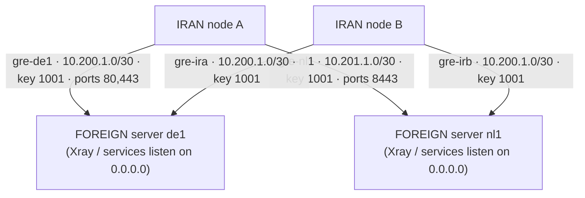

# Multi-GRE Tunnel Manager

<p>
  <a href="https://github.com/aibedini/gre-manager/actions/workflows/ci.yml"></a>
  <a href="https://github.com/aibedini/gre-manager/releases"></a>
  <a href="LICENSE"></a>
  
  
</p>

Menu-driven manager for **multiple GRE tunnels**: connect **many IRAN servers** to **many FOREIGN servers**,
with per-node and per-peer isolation, selective port forwarding (split between foreigns), an auto-healing
watchdog, and systemd persistence — all through a single `gre` command. Interactive menu for humans,
non-interactive CLI for automation.

> **راهنمای قدم‌به‌قدم فارسی:** [docs/GUIDE.fa.md](docs/GUIDE.fa.md) — نصب از صفر تا چند-خارج، با خروجی نمونه و عیب‌یابی.



One Iran server can reach several foreign servers at once (**multi-foreign peers**, v2), and each foreign
server still accepts many Iran nodes — a full many-to-many topology.

## Contents

- [Features](#features)
- [Install](#install)
- [Quick start](#quick-start)
- [Menu guide](#menu-guide)
- [CLI reference](#cli-reference)
- [Automation example](#automation-example)
- [JSON status](#json-status)
- [Files & paths](#files--paths)
- [How it works](#how-it-works)
- [Watchdog & downtime tolerance](#watchdog--downtime-tolerance)
- [Notes & security](#notes--security)
- [Uninstall & purge](#uninstall--purge)
- [Upgrading](#upgrading)
- [Upgrading from v1.x](#upgrading-from-v1x)
- [Versioning](#versioning)
- [راهنمای فارسی](#راهنمای-فارسی)

---

## Features

**Core**
- **One command** — after install, just run `sudo gre` and the menu loads.
- **Multi-foreign (v2)** — one Iran server connects to **several foreign servers** at once; each peer gets its own tunnel, `/30` subnet, GRE key and port set. Peers are added/removed independently without touching healthy connections.
- **Multi-node** — each Iran server gets its own tunnel name, `/30` subnet and GRE key on the foreign side; up to 254 nodes per subnet pool on one foreign server.
- **Port splitting** — forward only the TCP/UDP ports you choose from each Iran public IP, and split them between foreigns (e.g. `443/tcp → de1`, `8443/tcp → nl1`). **Each (protocol, port) belongs to exactly one foreign** — overlaps are rejected with a clear error; TCP and UDP are independent.
- **Per-peer subnets** — automatic subnet pool `10.200`–`10.254`; the pair (subnet base, index) is guaranteed unique per server.
- **systemd persistence** — tunnels and NAT rules are re-applied automatically after reboot (`multi-gre.service`).

**Reliability**
- **Auto-heal watchdog** — a systemd timer re-checks every tunnel and every peer, and revives only the dead ones (`journalctl -t gre-watchdog`).
- **Your downtime tolerance** — at setup you say how many minutes of downtime are acceptable; the watchdog interval is derived from it. Change or cancel anytime.
- **MSS clamping** — optional TCPMSS clamp on the tunnel to avoid broken-PMTU stalls (half-loading websites).
- **Idempotent & safe** — re-running any action never duplicates iptables rules; deletions check existence first. Peer rules carry per-peer comments (`multi-gre-iran-<name>-*`) so removal is exact.

**Security**
- **GRE whitelist (firewall hardening)** — on the foreign server, only known Iran node IPs may speak GRE (proto 47); everything else is dropped. Setup warns first if other (unmanaged) GRE tunnels exist that would be blocked.
- **Coexistence checks** — `gre doctor` detects GRE tunnels not managed by gre-manager and warns instead of touching them; per-peer iptables comments keep every rule attributable and removable.
- **Pairing fingerprint** — `gre status` prints an identical `pair: IRAN_IP <-> FOREIGN_IP · SUBNET.IDX.0/30 · key N` line on both sides of a tunnel so you can verify which two ends are linked (same name on both sides recommended, not required).
- **Checksum-verified installs** — installer and `gre update` verify the release SHA-256 before touching your system.
- **Config permissions** — all files under `/etc/multi-gre/` are mode `0600`.
- **Audit log** — every change is appended to `/var/log/gre-manager.log`.

**Operations & automation**
- **Non-interactive CLI** — every setup step can be scripted (`gre node add`, `gre iran peer add`, `gre iran-setup`, …) for Ansible & co.
- **JSON status** — `gre status --json` for monitoring systems (pure bash, no `jq` needed), schema version 2.
- **Doctor** — `gre doctor` runs health checks (tunnels, NAT rules, firewall, systemd, port conflicts, peer collisions) and exits non-zero on failure.
- **Backup & restore** — `gre export` / `gre import` move the whole configuration between servers as a single tar.gz (both v1 and v2 layouts accepted).
- **Automatic v1→v2 migration** — installing v2 on a v1 system converts the old single-foreign config automatically, keeping a rollback backup.
- **Three cleanup levels** — uninstall (this version), legacy cleanup (vatanhost script), and `gre purge` (scorched earth: every GRE artifact from any version or tool).
- **Self-update** — `gre update` pulls the latest pinned release from GitHub.

## Install

On **every** server (foreign and all Iran nodes):

```bash
curl -fsSL https://raw.githubusercontent.com/aibedini/gre-manager/main/install.sh | sudo bash
```

The installer downloads the latest **pinned release**, verifies its **SHA-256 checksum**,
installs the `gre` command to `/usr/local/sbin/gre` plus bash completion, and shows progress:

```
  Multi-GRE Tunnel Manager — installer
  github.com/aibedini/gre-manager

  Checking dependencies        [################################] 25%
  Downloading gre-manager      [################################] 55%
  Verifying SHA-256 checksum   [################################] 75%
  Installing gre command       [################################] 100%

  [+] gre-manager v2.0.0 installed -> /usr/local/sbin/gre
```

For the bleeding-edge main branch instead (no checksum):

```bash
curl -fsSL https://raw.githubusercontent.com/aibedini/gre-manager/main/install.sh | sudo GRE_EDGE=1 bash
```

Then run:

```bash
sudo gre
```

```
   __________  ____     __  ___
  / ____/ __ \/ __ \   /  |/  /__ _____  ____ _____ ____  _____
 / / __/ /_/ / /_/ /  / /|_/ / _ `/ _ \/ _ `/ _ `/ -_) __/
 \____/_/ |_/_____/  /_/  /_/\_,_/_//_/\_,_/\_, /\__/_/
                                           /____/
  Multi-GRE Tunnel Manager  v2.0.1  ·  github.com/aibedini/gre-manager
  ═════════════════════════════════════════════════════════════
  Role: IRAN (peers: 2/2 up)   Tunnels: ● 2 up   Watchdog: ● ON · every 1m
  ── Tunnels ─────────────────────────────────────────────────
  1) Configure this server as IRAN (add / manage foreign peers)
  2) Configure this server as FOREIGN / add an Iran node
  3) Remove an Iran node from FOREIGN                  [0 nodes]
  4) Restart all configured tunnels
  5) Stop all configured tunnels
  ── Monitoring ──────────────────────────────────────────────
  6) Status & health
  7) Auto-heal watchdog                                ● ON · every 1m
  8) Doctor (diagnostics)
  ── Maintenance ─────────────────────────────────────────────
  9) Backup / restore (export / import)
 10) Clean up original vatanhost gre.sh (vatan-m2)
 11) Update gre-manager to the latest version
 12) Uninstall from this server
 13) PURGE: remove EVERYTHING GRE (danger)
  0) Exit
  ═════════════════════════════════════════════════════════════
```

## Quick start

1. **FOREIGN server** — run `sudo gre`, choose **2**. On first run it registers the foreign IP,
   asks about firewall hardening and your downtime tolerance, then adds one Iran node per run.
   After each node it prints the exact values to enter on the Iran side (including the tunnel
   subnet base and the ready-made `gre iran peer add` command).
2. **Each IRAN server** — run `sudo gre`, choose **1** → add a peer, enter the values from step 1
   (peer name, subnet base, tunnel index, GRE key must match) plus the ports you want to forward
   to that foreign.
3. **A second foreign on the same Iran** — choose **1** → add a peer again with the new foreign's
   values. The next free subnet base (`10.201`, `10.202`, …) is suggested automatically.
   **The port-splitting rule:** each (protocol, port) on the Iran public IP belongs to **exactly
   one foreign** — e.g. send `80,443/tcp` to `de1` and `8443/tcp` to `nl1`. Overlapping ports
   (including ranges) are rejected; the same port number may still be used on TCP for one peer
   and UDP for another.
4. **Verify** — from Iran `ping <subnet-base>.<idx>.1`, from foreign `ping <subnet-base>.<idx>.2`,
   or use menu option **6** (live ping per node/peer) / **8** (doctor).

Addressing plan (automatic — subnet base, index and key are suggested for you):

| Peer/node | Tunnel     | Subnet base | Foreign side    | Iran side       | GRE key |
| --------- | ---------- | ----------- | --------------- | --------------- | ------- |
| `ir01`    | `gre-ir01` | `10.200`    | `10.200.1.1/30` | `10.200.1.2/30` | `1001`  |
| `ir02`    | `gre-ir02` | `10.200`    | `10.200.2.1/30` | `10.200.2.2/30` | `1002`  |
| `de1`     | `gre-de1`  | `10.200`    | `10.200.1.1/30` | `10.200.1.2/30` | `1001`  |
| `nl1`     | `gre-nl1`  | `10.201`    | `10.201.1.1/30` | `10.201.1.2/30` | `1001`  |

(`ir01`/`ir02`: Iran nodes as seen on one foreign server; `de1`/`nl1`: two foreign peers on one Iran server.)

## Menu guide

| Option | What it does |
| ------ | ------------ |
| **1** | Configure this server as IRAN: list peers, add a peer (interactive; asks IPs, name, subnet base, index, key, ports, MSS clamp, downtime tolerance), remove a peer. On a fresh server a "Start here" hint points to options 1 (Iran) and 2 (Foreign) |
| **2** | Configure this server as FOREIGN (first run) / add another Iran node (subsequent runs) |
| **3** | Remove one Iran node from FOREIGN (tunnel + firewall rule + config) |
| **4** | Restart all configured tunnels (stop + apply, idempotent) |
| **5** | Stop all tunnels but keep config (they return after reboot or menu 4) |
| **6** | Status: roles, tunnels, addresses, NAT rules, live ping per node/peer, systemd states |
| **7** | Watchdog submenu: live state, change downtime tolerance, enable, disable |
| **8** | Doctor: PASS/WARN/FAIL diagnostics with non-zero exit on failure |
| **9** | Backup/restore submenu: export config to tar.gz, import it back |
| **10** | Remove everything the original `vatanhost/gre` script created |
| **11** | Self-update to the latest release (checksum-verified) |
| **12** | Uninstall gre-manager from this server (keeps nothing) |
| **13** | **PURGE** — remove EVERYTHING GRE-related (see [below](#uninstall--purge)) |
| **0** | Exit (Ctrl+C anywhere returns to the menu instead of killing the program) |

## CLI reference

| Command | Description |
| ------- | ----------- |
| `gre` | Interactive menu |
| `gre status [--json]` | Status; `--json` for machine-readable output (no `jq` needed) |
| `gre doctor` | Diagnostics: PASS/WARN/FAIL per check, non-zero exit on FAIL |
| `gre node list [--json]` | List configured Iran nodes (FOREIGN) |
| `gre node add` | Add an Iran node (FOREIGN): `--name NAME --ip IRAN_IP [--idx N] [--key K] [--subnet-base A.B] [--yes]` |
| `gre node remove` | Remove an Iran node (FOREIGN): `--name NAME [--yes]` |
| `gre iran peer list [--json]` | List foreign peers of this Iran server |
| `gre iran peer add` | Connect this Iran to a foreign: `--name NAME --foreign-ip IP [--iran-ip IP] [--subnet-base A.B] [--idx N] [--key K] [--wan IFACE] [--tcp-ports LIST] [--udp-ports LIST] [--mss-clamp on\|off] [--yes]` |
| `gre iran peer remove` | Remove one foreign peer (only its tunnel/rules/config): `--name NAME [--yes]` |
| `gre iran peer apply` | Re-apply one peer's tunnel + rules: `--name NAME` |
| `gre iran-setup` | Non-interactive first-peer Iran setup (legacy v1-compatible): `--foreign-ip IP [--iran-ip IP] [--name NAME] [--idx N] [--key K] [--subnet-base A.B] [--wan IFACE] [--tcp-ports LIST] [--udp-ports LIST] [--mss-clamp on\|off] [--downtime MIN] [--yes]` |
| `gre export [path] [--yes]` | Back up `/etc/multi-gre` to a tar.gz (mode 600) |
| `gre import <file> [--yes]` | Restore a backup created by `gre export` (v1 and v2 layouts; rejects unsafe archives) |
| `gre watchdog` | Watchdog: `enable` / `disable` / `status` / `interval <1-60>` |
| `gre update` | Self-update to the latest release (SHA-256 verified) |
| `gre purge [--yes]` | Remove EVERYTHING GRE-related from the server |
| `gre --apply` | Bring up all configured tunnels (used by systemd) |
| `gre --stop` | Tear down all tunnels, keep config (used by systemd) |
| `gre --watchdog` | One watchdog pass over all nodes and peers (used by the systemd timer) |
| `gre --version` / `gre --help` | Version / usage |

All mutating commands ask for confirmation unless `--yes` is passed.
`gre iran peer add` with values identical to an existing peer succeeds idempotently; different
values are rejected (remove the peer first, then re-add).

### Automation example

```bash
# FOREIGN server (run 'sudo gre' -> option 2 once first for the initial setup):
gre node add --name ir01 --ip 5.6.7.8 --yes          # idx/key default to 1/1001
gre node add --name ir02 --ip 5.6.7.9 --yes
gre node list --json

# IRAN server — first foreign:
gre iran-setup --foreign-ip 1.2.3.4 --name ir01 --idx 1 --key 1001 \
    --tcp-ports 80,443 --udp-ports 443 --downtime 2 --yes

# IRAN server — a second foreign (ports split: 8443 belongs to nl1 only):
gre iran peer add --name nl1 --foreign-ip 9.8.7.6 --subnet-base 10.201 \
    --idx 1 --key 1001 --tcp-ports 8443 --yes

# Monitoring / config management:
gre status --json
gre doctor                                           # exit code != 0 if anything FAILs
gre export /root/gre-backup.tar.gz --yes
gre watchdog interval 2                              # check every 2 minutes
```

## JSON status

`gre status --json` (schema version 2, two peers configured on the Iran side):

```json
{
  "version": "2.0.0",
  "schema_version": 2,
  "roles": ["iran"],
  "service": "enabled",
  "watchdog": "active",
  "tunnels_up": 2,
  "nodes": [],
  "iran_peers": [
    {"name":"de1","foreign_ip":"203.0.113.10","subnet_base":"10.200","idx":1,"key":1001,"tun":"gre-de1","tcp_ports":"80,443","udp_ports":"443","reachable":true},
    {"name":"nl1","foreign_ip":"203.0.113.11","subnet_base":"10.201","idx":1,"key":1001,"tun":"gre-nl1","tcp_ports":"8443","udp_ports":"","reachable":false}
  ],
  "iran": null
}
```

- New consumers must read **`iran_peers`** (one entry per foreign peer, with live reachability).
- The legacy **`iran`** field is still emitted — marked `"deprecated":true` — but only for
  single-peer setups; with zero or multiple peers it is `null`.
- On the foreign side, `nodes[]` entries gain a `subnet_base` field (defaults to `10.200`).

## Files & paths

| Path | Purpose |
| ---- | ------- |
| `/usr/local/sbin/gre` | The `gre` command |
| `/etc/multi-gre/foreign.conf` | Foreign role: IP, ICMP drop, GRE whitelist flags |
| `/etc/multi-gre/iran.conf` | Iran role **manifest** (v2: `SCHEMA_VERSION=2`, `ROLE_IRAN=1`) |
| `/etc/multi-gre/iran.conf.v1.bak` | Backup of the legacy v1 `iran.conf` after automatic migration (rollback) |
| `/etc/multi-gre/foreigns/<name>.conf` | One file per foreign peer (Iran side): IPs, subnet base, index, key, tunnel, ports, MSS flag |
| `/etc/multi-gre/global.conf` | Watchdog: enabled, interval, downtime tolerance |
| `/etc/multi-gre/nodes/<name>.conf` | One file per Iran node (foreign side), incl. `SUBNET_BASE` |
| `/etc/systemd/system/multi-gre.service` | Re-applies everything at boot (`gre --apply`) |
| `/etc/systemd/system/multi-gre-watchdog.{service,timer}` | Auto-heal watchdog |
| `/etc/sysctl.d/99-multi-gre.conf` | `net.ipv4.ip_forward=1` (Iran side) |
| `/var/log/gre-manager.log` | Audit log (who changed what, when) |
| `/etc/bash_completion.d/gre` | bash completion |

## How it works

- **IRAN node**: packets arriving on the public IP at the configured ports are DNAT-ed into the
  matching peer's tunnel towards `<subnet-base>.<idx>.1` (the foreign end) and SNAT-ed to
  `<subnet-base>.<idx>.2`, so replies flow back through conntrack automatically. Each peer's
  rules are independent and comment-tagged (`multi-gre-iran-<name>-*`), so one peer can be
  removed or repaired without touching the others. `net.ipv4.ip_forward` is enabled and persisted.
- **FOREIGN node**: one GRE tunnel per Iran node. Services listening on `0.0.0.0`
  (e.g. Xray) are reachable through every tunnel at once.
- **Boot persistence**: the systemd unit runs `gre --apply`, which recreates tunnels and re-adds
  only the missing iptables rules (never duplicates).
- **GRE whitelist ordering**: per-node ACCEPT rules are always re-inserted before the proto-47
  block rule, so adding a node never breaks existing ones.
- **Port ownership**: collision checks (subnet, tunnel name, ports incl. ranges) run before any
  config is written or rule is applied, so two peers can never fight over the same port.

## Watchdog & downtime tolerance

At setup you are asked:

```
[*] Auto-heal watchdog
[*] If a tunnel dies, the watchdog revives it automatically.
[*] How many minutes of tunnel downtime are acceptable for you? (0 = disable auto-heal)
Downtime tolerance in minutes [2]:
```

- The watchdog checks every `tolerance / 2` minutes (minimum 1), so real downtime stays under your number.
- Every node **and every foreign peer** is checked; only dead ones are re-applied.
- `0` disables auto-heal entirely.
- Change or cancel **anytime**: menu option **7**, or `gre watchdog interval N` / `gre watchdog disable` / `gre watchdog enable`.
- Watchdog actions are logged to the journal: `journalctl -t gre-watchdog`.
- For automation: `gre iran-setup ... --downtime MIN`.

## Notes & security

- GRE is **not encrypted** — it is a transport/tunnel, not a VPN. Run your real service (e.g. Xray/TLS) on top.
- The GRE `key` only separates tunnels; it is not authentication.
- Only the ports you list are forwarded — SSH access to each Iran server stays local unless you explicitly forward port 22.
- **No shared-port failover yet**: a port can belong to only one foreign at a time. If that
  foreign dies, its ports are down until you move them to another peer (failover/load-balancing
  of a shared port is planned for v2.1+).
- Distributing ports across several foreigns also distributes risk: if one foreign IP gets
  blocked, only its ports are affected.
- Works on systemd-based Debian/Ubuntu (and most RHEL-likes); requires `iproute2`, `iptables`, `curl`.
- Modern distros with `iptables-nft` are supported — rules land in nftables automatically.

## Uninstall & purge

Three cleanup levels, depending on how deep you want to go:

| Level | Command | Removes |
| ----- | ------- | ------- |
| **Uninstall** | menu **12** | Everything this gre-manager version configured (tunnels, rules, units, config, the `gre` command) |
| **Legacy cleanup** | menu **10** | Only what the original `vatanhost/gre` script created (`vatan-m2`, its broad rules) |
| **PURGE** | `gre purge` / menu **13** | **Everything GRE-related** from any version or tool |

```bash
sudo gre   # -> option 12 (Uninstall) or 13 (PURGE)

sudo gre purge        # asks for confirmation
sudo gre purge --yes  # non-interactive
```

PURGE deletes every GRE/GRETAP tunnel (even hand-made ones), every iptables rule in
`filter`/`nat`/`mangle` mentioning GRE artifacts (`multi-gre` — including the per-peer
`multi-gre-iran-<name>-*` comments — GRE interfaces, proto 47, `10.200.0.0/16`,
`132.168.30.0/30`), the legacy vatanhost broad rules, all systemd units, `/etc/multi-gre`,
the sysctl file, the audit log, bash completion, and the `gre` / `multi-gre-manager`
commands themselves. If other software on the server uses GRE, it will be affected — the
warning lists everything before you confirm.

## Upgrading

```bash
sudo gre update
```

Prefers the latest **pinned release**, verifies its SHA-256 checksum, refuses to install on
mismatch, and only falls back to the main branch (with a warning) when release assets are
unavailable. Your configuration, watchdog settings, nodes and peers are preserved across updates.

## Upgrading from v1.x

v2.0.0 changes the Iran-side config layout (single `iran.conf` → manifest + per-peer files in
`foreigns/`). The upgrade is **automatic**:

1. Update as usual (`sudo gre update` or re-run the installer).
2. On the first operational command (`gre --apply`, a status, adding a peer, an import — anything
   except `--help`/`--version`), a legacy v1 `iran.conf` is detected and migrated:
   - an equivalent peer (`SUBNET_BASE=10.200`) is written atomically to
     `/etc/multi-gre/foreigns/<name>.conf`,
   - `iran.conf` becomes the v2 manifest,
   - the original file is kept as **`/etc/multi-gre/iran.conf.v1.bak`** (mode 0600),
   - the old un-commented iptables rules are replaced by their comment-tagged v2 equivalents
     with no duplicate rules and no unnecessary downtime.
3. Migration is idempotent — re-running changes nothing. An inconsistent half-old/half-new
   layout aborts with a clear error instead of silently overwriting anything.

**Rollback to v1.x** (if you ever need it):

```bash
sudo gre --stop                                              # tear down tunnels + rules
sudo cp /etc/multi-gre/iran.conf.v1.bak /etc/multi-gre/iran.conf
sudo rm -rf /etc/multi-gre/foreigns
# reinstall the previous v1.5.0 release, then:
sudo gre --apply
```

Everything else (foreign role, nodes, watchdog settings, global.conf) is untouched by the
migration.

## Versioning

This project uses [Semantic Versioning](https://semver.org/). Every `v*` tag automatically
builds the `gre` + `gre.sha256` release assets via GitHub Actions; CI runs ShellCheck,
syntax checks, the full test suite (`tests/run.sh` — multi-peer, migration, idempotency,
regression) and a version-consistency check on every push.
See [CHANGELOG.md](CHANGELOG.md) and the [releases page](https://github.com/aibedini/gre-manager/releases).

## License

[MIT](LICENSE)

---

## راهنمای فارسی

> 📖 **[راهنمای کامل قدم‌به‌قدم (توصیه می‌شود)](docs/GUIDE.fa.md)** — از نصب تا چند ایران و چند خارج، با خروجی نمونه، تست و عیب‌یابی.

این ابزار چند سرور **ایران** را از طریق تونل GRE به چند سرور **خارج** وصل می‌کند؛ یعنی هم روی هر سرور خارج چند نود ایران جا می‌شود، هم **هر سرور ایران می‌تواند هم‌زمان به چند سرور خارج وصل باشد** (multi-foreign — از ورژن ۲). هر تونل، ساب‌نت و کلید GRE اختصاصی خودش را دارد.

### نصب (روی همهٔ سرورها)

```bash
curl -fsSL https://raw.githubusercontent.com/aibedini/gre-manager/main/install.sh | sudo bash
sudo gre
```

نصب‌کننده آخرین ریلیز رسمی را با تأیید checksum (SHA-256) نصب می‌کند.

### ترتیب راه‌اندازی

1. روی سرور **خارج**: `sudo gre` → گزینهٔ `2` — بار اول IP خارج، سؤال امنیتی فایروال و «تحمل قطعی» را می‌پرسد؛ بعد برای هر سرور ایران یک بار اجرا کنید. آخر کار مقادیری می‌دهد (نام نود، subnet base، index، key و دستور آمادهٔ `gre iran peer add`).
2. روی هر سرور **ایران**: گزینهٔ `1` → افزودن peer — همان مقادیر را وارد کنید و پورت‌هایی که باید به همان سرور خارج منتقل شوند را بدهید (مثلاً `80,443`).
3. **افزودن سرور خارج دوم به همان ایران**: دوباره گزینهٔ `1` → افزودن peer با مقادیر سرور خارج جدید. ساب‌نت آزاد بعدی (`10.201`، `10.202`، …) خودکار پیشنهاد می‌شود.
4. تست: گزینهٔ `6` (پینگ زندهٔ هر نود/peer) یا گزینهٔ `8` (doctor) یا `ping <subnet-base>.<idx>.1` از سمت ایران.

### قانون تقسیم پورت بین سرورهای خارج (مهم)

هر پورت (روی هر پروتکل) فقط به **یک** سرور خارج تعلق دارد؛ مثلاً `443/tcp` به de1 و `8443/tcp` به nl1. اگر پورت یا رنج دو peer با هم تداخل داشته باشد، با خطای واضح رد می‌شود. TCP و UDP مستقل‌اند — یعنی یک شمارهٔ پورت می‌تواند روی TCP به یک سرور و روی UDP به سرور دیگر برود. فیلتر شدن یک سرور خارج فقط پورت‌های همان را قطع می‌کند. (توزیع بار یا failover روی یک پورت مشترک فعلاً نیست؛ برای v2.1+ برنامه‌ریزی شده.)

### ارتقا از ورژن ۱.x (مهاجرت خودکار)

اگر روی سرور ایران ورژن قدیمی نصب بوده، با اولین دستور عملیاتی (مثل `gre --apply`) کانفیگ قدیمی `iran.conf` **خودکار** به ساختار جدید تبدیل می‌شود: peer معادل در `foreigns/` ساخته می‌شود، `iran.conf` به manifest تبدیل می‌شود و نسخهٔ قدیمی در `‎/etc/multi-gre/iran.conf.v1.bak` برای بازگشت نگه داشته می‌شود. ruleهای قدیمی هم با معادل کامنت‌دار جدید جایگزین می‌شوند (بدون قطعی اضافه و بدون rule تکراری). مهاجرت idempotent است و اگر ساختار ناقص/مخلوط باشد، به‌جای بازنویسی سکوت‌آمیز با خطا متوقف می‌شود. برای بازگشت به v1: فایل ‎`.v1.bak` را جای `iran.conf` بگذارید، پوشهٔ `foreigns` را حذف کنید و ورژن قبلی را دوباره نصب کنید.

### سؤال «تحمل قطعی» چیست؟

موقع نصب می‌پرسد چند دقیقه قطعی تونل برایتان قابل قبول است. واچداگ (بازسازی خودکار تونل مرده) بر اساس همان تنظیم می‌شود:

- مثلاً `4` دقیقه → واچداگ هر ۲ دقیقه چک می‌کند تا قطعی واقعی زیر ~۴ دقیقه بماند
- هر نود و هر peer جداگانه چک می‌شود و فقط مرده‌ها بازسازی می‌شوند
- `0` → auto-heal کاملاً خاموش
- تغییر یا لغو در هر زمان: گزینهٔ `7` در منو، یا `gre watchdog interval N` و `gre watchdog disable`

### قابلیت‌های مهم

- **اتصال هم‌زمان به چند خارج** — هر peer تونل، ساب‌نت، کلید و پورت‌های مستقل دارد؛ حذف یا خرابی یکی به بقیه دست نمی‌زند
- **بازگشت خودکار بعد از reboot** — سرویس `multi-gre.service` همه‌چیز را دوباره بالا می‌آورد
- **واچداگ auto-heal** — تونل مرده را خودکار بازسازی می‌کند (`journalctl -t gre-watchdog`)
- **فایروال سمت خارج** — فقط IP نودهای شناخته‌شده می‌توانند GRE بزنند
- **MSS clamp** — رفع مشکل نصفه باز شدن سایت‌ها
- **پورت ۲۲ (SSH)** — پیش‌فرض منتقل نمی‌شود؛ اگر واردش کنید هشدار جدی می‌گیرید
- **اتوماسیون** — همهٔ کارها بدون منو: `gre node add --name ir01 --ip x.x.x.x --yes` و `gre iran peer add ... --yes`
- **خروجی JSON** — `gre status --json` با schema نسخهٔ ۲ و آرایهٔ `iran_peers`
- **بکاپ** — `gre export` / `gre import` برای جابه‌جایی کل تنظیمات بین سرورها (هم کانفیگ v1 هم v2)
- **به‌روزرسانی** — `sudo gre update` (با تأیید checksum)

### حذف و پاک‌سازی (سه سطح)

| سطح | دستور | چه چیزی پاک می‌شود |
| --- | --- | --- |
| حذف معمولی | گزینهٔ `12` | هرچه همین ورژن ساخته |
| پاک‌سازی vatanhost | گزینهٔ `10` | فقط آثار اسکریپت قدیمی vatanhost |
| **پاک‌سازی کامل** | `sudo gre purge` یا گزینهٔ `13` | **هر چه به GRE ربط دارد** — تونل‌ها (حتی دستی و ورژن‌های قدیمی)، همهٔ ruleهای مرتبط (از جمله ruleهای کامنت‌دار جدید هر peer)، یونیت‌ها، کانفیگ و خود دستور `gre` |

### نکات امنیتی

- GRE رمزنگاری **ندارد**؛ سرویس اصلی (مثل Xray) باید روی آن امن باشد.
- کلید GRE فقط برای تفکیک تونل‌هاست، رمز نیست.
- هر پورت فقط به یک سرور خارج می‌رسد؛ اگر IP یک سرور خارج فیلتر شود فقط پورت‌های همان قطع می‌شود — پخش کردن پورت‌ها بین چند خارج، ریسک را هم پخش می‌کند.
