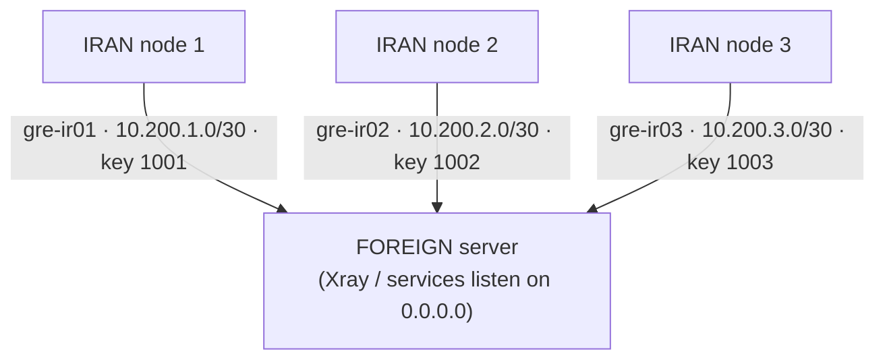

# Multi-GRE Tunnel Manager

<p>
  <a href="https://github.com/aibedini/gre-manager/releases"></a>
  <a href="LICENSE"></a>
  
  
</p>

Menu-driven manager for **multiple GRE tunnels**: connect **many IRAN servers** to **one FOREIGN server**,
with per-node isolation, port forwarding (DNAT/SNAT), and systemd persistence — all through a single `gre` command.



---

## Features

- **One command** — after install, just run `sudo gre` and the menu loads.
- **Multi-node** — each Iran server gets its own tunnel name, `/30` subnet and GRE key; up to 254 nodes.
- **Port forwarding** — forward only the TCP/UDP ports you choose from each Iran public IP to the foreign server (multiport + ranges, SSH port 22 protected by an explicit confirmation).
- **systemd persistence** — tunnels and NAT rules are re-applied automatically after reboot (`multi-gre.service`).
- **Watchdog** — a systemd timer re-checks every tunnel every minute and revives dead ones (`journalctl -t gre-watchdog`).
- **Firewall hardening** — optional GRE (proto 47) whitelist on the foreign server: only known Iran node IPs can connect.
- **MSS clamping** — optional TCPMSS clamp on the tunnel to avoid broken-PMTU stalls.
- **Audit log** — every change is appended to `/var/log/gre-manager.log`.
- **Idempotent & safe** — re-running any action never duplicates iptables rules; deletions check existence first.
- **Self-update** — `gre update` pulls the latest release from GitHub (with a syntax check before replacing).
- **Legacy cleanup** — one menu option removes everything the old `vatanhost/gre` script left behind.
- **Status & diagnostics** — per-node ping tests, tunnel list, NAT rules, service state.

## Install

On **every** server (foreign and all Iran nodes):

```bash
curl -fsSL https://raw.githubusercontent.com/aibedini/gre-manager/main/install.sh | sudo bash
```

Then run:

```bash
sudo gre
```

```
   __________  ____     __  ___
  / ____/ __ \/ __ \   /  |/  /__ _____  ____ _____ ____  _____
 / / __/ /_/ / /_/ /  / /|_/ / _ `/ _ \/ _ `/ _ `/ -_) __/
 \____/_/ |_/_____/  /_/  /_/\_,_/_//_/\_,_/\_, /\__/_/
                                           /____/
  Multi-GRE Tunnel Manager  v1.0.0  ·  github.com/aibedini/gre-manager
  ---------------------------------------------------------------
  Role: FOREIGN   Tunnels up: 3   Service: enabled
  ---------------------------------------------------------------
  1) Configure this server as an IRAN node
  2) Configure this server as FOREIGN / add an Iran node
  3) Remove an Iran node from FOREIGN
  4) Restart all configured tunnels
  5) Stop all configured tunnels
  6) Show status
  7) Uninstall from this server
  8) Clean up original vatanhost gre.sh (vatan-m2)
  9) Update gre-manager to the latest version
  0) Exit
```

## Quick start

1. **FOREIGN server** — run `sudo gre`, choose **2**. On first run it registers the foreign IP,
   then adds one Iran node per run. After each node it prints the exact values to enter on the Iran side.
2. **Each IRAN server** — run `sudo gre`, choose **1**, enter the values from step 1
   (node name, tunnel index, GRE key must match) plus the ports you want to forward.
3. Verify: from Iran `ping 10.200.<idx>.1`, from foreign `ping 10.200.<idx>.2` — or use menu option **6**.

| Node   | Tunnel     | Foreign side    | Iran side       | GRE key |
| ------ | ---------- | --------------- | --------------- | ------- |
| `ir01` | `gre-ir01` | `10.200.1.1/30` | `10.200.1.2/30` | `1001`  |
| `ir02` | `gre-ir02` | `10.200.2.1/30` | `10.200.2.2/30` | `1002`  |
| `ir03` | `gre-ir03` | `10.200.3.1/30` | `10.200.3.2/30` | `1003`  |

## CLI reference

| Command        | Description                                              |
| -------------- | -------------------------------------------------------- |
| `gre`          | Interactive menu                                         |
| `gre --status` | Show roles, tunnels, NAT rules, per-node ping, service   |
| `gre update`   | Self-update to the latest version                        |
| `gre watchdog` | Watchdog timer: `enable` / `disable` / `status`          |
| `gre --apply`  | Bring up all configured tunnels (used by systemd)        |
| `gre --stop`   | Tear down all tunnels, keep config (used by systemd)     |
| `gre --version`| Print version                                            |

## How it works

- **IRAN node**: packets arriving on the public IP at the configured ports are DNAT-ed into the tunnel
  towards `10.200.<idx>.1` (the foreign end) and SNAT-ed to `10.200.<idx>.2`, so replies flow back
  through conntrack automatically. `net.ipv4.ip_forward` is enabled and persisted.
- **FOREIGN node**: one GRE tunnel per Iran node. Services listening on `0.0.0.0`
  (e.g. Xray) are reachable through every tunnel at once.
- **Config** lives in `/etc/multi-gre/` — `/etc/multi-gre/nodes/<name>.conf` per Iran node (foreign side),
  `iran.conf` on each Iran node. The systemd unit runs `gre --apply` at boot.

## Notes & security

- GRE is **not encrypted** — it is a transport/tunnel, not a VPN. Run your real service (e.g. Xray/TLS) on top.
- The GRE `key` only separates tunnels; it is not authentication.
- Only the ports you list are forwarded — SSH access to each Iran server stays local unless you explicitly forward port 22.
- If the foreign server's IP gets blocked, all nodes lose connectivity: the foreign host is a single point of failure.
- Works on systemd-based Debian/Ubuntu (and most RHEL-likes); requires `iproute2`, `iptables`, `curl`.

## Uninstall

```bash
sudo gre   # -> option 7
```

Removes tunnels, NAT rules, the systemd service, the sysctl file, `/etc/multi-gre` and the `gre` command itself.

## Versioning

This project uses [Semantic Versioning](https://semver.org/). See [CHANGELOG.md](CHANGELOG.md) and the
[releases page](https://github.com/aibedini/gre-manager/releases).

## License

[MIT](LICENSE)

---

## راهنمای فارسی

این ابزار چند سرور **ایران** را از طریق تونل GRE به **یک سرور خارج** وصل می‌کند؛ هر سرور ایران تونل، ساب‌نت و کلید اختصاصی خودش را دارد.

**نصب (روی همهٔ سرورها):**

```bash
curl -fsSL https://raw.githubusercontent.com/aibedini/gre-manager/main/install.sh | sudo bash
sudo gre
```

**ترتیب راه‌اندازی:**

1. روی سرور **خارج**: گزینهٔ `2` — برای هر سرور ایران یک بار اجرا کنید؛ آخر کار مقادیری می‌دهد (نام نود، index، key).
2. روی هر سرور **ایران**: گزینهٔ `1` — همان مقادیر را وارد کنید و پورت‌هایی که باید به خارج منتقل شوند را بدهید (مثلاً `80,443,8443`).
3. تست: گزینهٔ `6` یا `ping 10.200.<idx>.1` از سمت ایران.

- پورت ۲۲ (SSH) به‌صورت پیش‌فرض منتقل نمی‌شود؛ اگر واردش کنید هشدار می‌گیرید.
- تنظیمات بعد از reboot خودکار برمی‌گردند (سرویس `multi-gre.service`).
- به‌روزرسانی: `sudo gre update`
- حذف کامل: گزینهٔ `7` در منو
- پاک‌سازی اسکریپت قدیمی vatanhost: گزینهٔ `8`
- GRE رمزنگاری ندارد؛ سرویس اصلی (مثل Xray) باید روی آن امن باشد.
